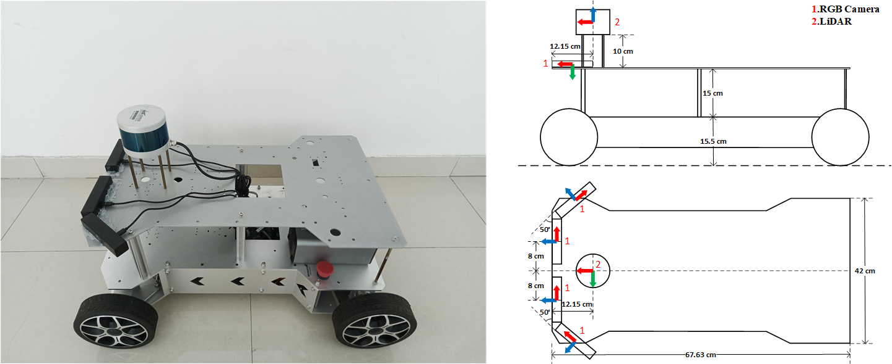
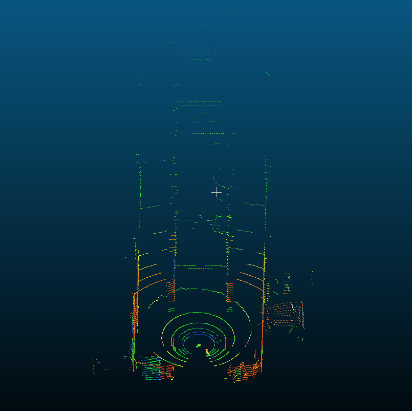

# MLDOP: A Multi-Camera and LiDAR Dataset for 3D Occupancy Perception

## 1. SENSOR SETUP
### 1.1 Acquisition Platform
Physical drawings and schematics of the ground robot is given below.

Figure 1. The WHEELTEC ground robot equipped with a lidar and four RGB cameras. The directions of the sensors are marked in different colors, red for X, green for Y and blue for Z. The camera id are named 0~3 from front_right to front_left successively.

### 1.2 Sensor parameters
All the sensors and their most important parameters are listed as below:

* **LIDAR** LeiShen Intelligent C16-151B, 360 Horizontal Field of View (FOV), -15 to +15 Vertical FOV, 20Hz, Max Range 200 m, Range Resolution 3 cm,  Horizontal Angular Resolution 0.36°.  

* **RGB Camera** HIKVISION U64, 1280*720, 81 H-FOV, 90 D-FOV, 30 Hz 

## 2. DATASET SEQUENCES

**We make public ALL THE SEQUENCES with their imgs captured from 4 cameras and lidar_txt/lidar_pcd files now.**

All the sequences are acquired in Shandong University, Qingdao, including indoor and outdoor scenes. Dataset link is: [MLDOP](https://pan.baidu.com/s/1gbmSz3IvnNdX-tPp6iJ0Kg?pwd=dpai)

Figure 2. An image frame acquired by four cameras.

Figure 3. A lidar frame acquired by lidar.

An overview of MLDOP is given in the tables below:

**Indoor**

Scenario|Number|Size of imgs/GB|Size of lidar_txt/GB|Size of lidar_pcd/GB|Duration/s
--|:--:|:--:|:--:|:--:|:--:
Canteen|3|17.4|13.7|27.3|747
Fengyu|1|8.3|5.1|9.5|261
Huiwen|2|3.3|5.7|10.6|272
Library|1|5.1|4.5|11.9|254
Museum|2|10.2|13.4|32|669
N5|4|18.2|26.6|51.8|1295
N7|2|3.7|5.9|11.2|271
Shoppingmall|2|5.2|6.2|11.7|312
Zhensheng|1|7.3|11.6|21.7|580
TOTAL|18|78.7|92.7|187.7|4661

**Outdoor**

Scenario|Number|Size of imgs/GB|Size of lidar_txt/GB|Size of lidar_pcd/GB|Duration/s
--|:--:|:--:|:--:|:--:|:--:
Between_zhensheng_and_huagang|1|6.0|4.7|8.8|186
Dark|1|3.2|3.2|6.0|155
Dark_library|1|15.1|12.5|23.7|739
Fengyu_north|1|16.4|6.8|13.0|423
Huagang-zhensheng_west|1|28.8|13.7|25.8|794
Museum|1|20.0|8.4|17.7|788
N1_west-N5_north|1|28.9|14.8|27.8|837
N5_north-N1_west|1|26.3|12.2|22.7|661
Playground_south|1|3.6|2.6|4.9|143
Zhensheng_north|1|20.2|10.1|19.2|595
Zhensheng_north-N1_north|1|5.5|2.4|4.7|155
TOTAL|11|174.0|91.4|174.3|5476

Our model 3DOPFormer has currently only been trained and tested on indoor scene dataset, the division of the indoor scene dataset is as follows:

train|val|test|
:--:|:--:|:--:
canteen_floor_1|huiwen_floor_1|N7_floor_1
canteen_floor_2|N5_floor_1_north|N5_floor_1_south
canteen_floor_3
fengyu
huiwen_floor_2
library_floor_2
museum_floor_2
museum_floor_4
N5_floor_1
N5_floor_2
N7_floor_2
shoppingmall_floor_1
shoppingmall_floor_2
zhensheng

### 2.1 Indoors

Sequence name|Collection date|Size of imgs/GB|Size of lidar_txt/GB|Size of lidar_pcd/GB|Duration/s
--|:--:|:--:|:--:|:--:|:--:
indoor_canteen_floor_1|2023-03-07|6.1|4.8|10.6|254
indoor_canteen_floor_2|2023-03-07|5.8|4.0|7.5|219
indoor_canteen_floor_3|2023-03-07|5.5|4.9|9.2|274
indoor_fengyu|2023-03-09|8.3|5.1|9.5|261
indoor_huiwen_floor_1|2023-03-08|1.5|2.8|5.2|129
indoor_huiwen_floor_2|2023-03-08|1.8|2.9|5.4|143
indoor_library_floor_2|2023-03-06|5.1|4.5|11.9|254
indoor_museum_floor_2|2023-03-08|4.1|5.4|13.7|266
indoor_museum_floor_4|2023-03-08|6.1|8.0|18.3|403
indoor_N5_floor_1|2023-03-06|7.4|12.1|23.2|596
indoor_N5_floor_2|2023-03-06|7.7|11.6|22.3|577
indoor_N5_floor_1_north|2022-12-04|1.6|1.6|2.9|59
indoor_N5_floor_1_south|2022-12-04|1.5|1.3|3.4|63
indoor_N7_floor_1|2023-03-07|1.5|2.6|5.0|112
indoor_N7_floor_2|2023-03-07|2.2|3.3|6.2|159
indoor_shoppingmall_floor_1|2023-03-07|2.7|2.7|5.2|137
indoor_shoppingmall_floor_2|2023-03-07|2.5|3.5|6.5|175
indoor_zhensheng|2023-03-06|7.3|11.6|21.7|580

### 2.2 Outdoors

Sequence name|Collection date|Size of imgs/GB|Size of lidar_txt/GB|Size of lidar_pcd/GB|Duration/s
--|:--:|:--:|:--:|:--:|:--:
outdoor_between_zhensheng_and_huagang|2023-03-07|6.0|4.7|8.8|186
outdoor_dark|2023-03-07|3.2|3.2|6.0|155
outdoor_dark_library|2023-03-08|15.1|12.5|23.7|739
outdoor_fengyu_north|2023-03-09|16.4|6.8|13.0|423
outdoor_huagang-zhensheng_west|2023-03-09|28.8|13.7|25.8|794
outdoor_museum|2023-03-07|20.0|8.4|17.7|788
outdoor_N1_west-N5_north|2023-03-06|28.9|14.8|27.8|837
outdoor_N5_north-N1_west|2023-03-06|26.3|12.2|22.7|661
outdoor_playground_south|2023-03-07|3.6|2.6|4.9|143
outdoor_zhensheng_north|2023-03-06|20.2|10.1|19.2|595
outdoor_zhensheng_north-N1_north|2023-03-07|5.5|2.4|4.7|155

## 3. DEVELOPMENT TOOLKITS
### Dependencies
- python=3.9.5
- numpy=1.20.2
- pip=21.1.1
- tqdm=4.61.2
- pip:
  - pyyaml==6.0
  - dpkt==1.9.7.2
### 3.1 Extracting lidar data frame from pcap files
As we use the LSC16-[Client] software provided by LeiShen Intelligent Company to acquire lidar data on Windows platform in the form of pcap file, so that we need to extract lidar data frame from these pcap files.  

Firstly, we filter out data packages using Wireshark software due to the presence of both data and device packages in the pcap file. The filtered pcap files are provided in our dataset: __lidar_pcap_indoor.zip__ and __lidar_pcap_outdoor.zip__.

Then, git clone this project, check the parameters in params.yaml, if on Linux platform, run: 
~~~
bash run_indoor.sh
~~~
or
~~~
bash run_outdoor.sh
~~~
You can change the --path and --out-dir parameter in above .sh files according to the actual situation.

If on Windows platform, run: 
~~~
python main.py --path your_path --out-dir your_out-dir --config=.\params.yaml
~~~

After this operation, we get TXT files/PCD files named as index and time (Beijing).

#### Output
Full 360° frame store in a file. 
All TXT files have the following fields: 
Timestamp, Laser_ID, X [m], Y [m], Z [m], Intensity [0-255], Vertical_angle [Angle system], Horizontal_angle [Angle system], Distance [m]

All PCD files have the following fields: 
X [m], Y [m], Z [m], Intensity [0-255]

The TXT files and PCD files are provided in our dataset: __lidar_indoor_txt.zip__, __lidar_outdoor_txt.zip__, __lidar_indoor_pcd.zip__, __lidar_outdoor_pcd.zip__.

#### Note
This part is based on https://github.com/hitxing/Lidar-data-decode/ which supports LSC32. Actually, this project can support any lidar as long as you change the parameters follow the corresponding technical manual.

### 3.2 Generating data_all.pkl
For the convenience of using this dataset, we has generated a .pkl file, which stores a data_dict. In this data_dict, imgs_path are classified by img0_key and camera_id, lidar_path are classified by img0_key (img0_key is the imgs_path of camera 0). 

If on Linux platform, run: 
~~~
bash data_pkl.sh
~~~
You can change the --imgs_path and --lidar_path parameter in above .sh files according to the actual situation.

If on Windows platform, run: 
~~~
python data_pkl.py --imgs_path your_imgs_path --lidar_path your_lidar_path
~~~

After this operation, we get data_all.pkl. This file is provided in our dataset: __data_pkl.zip__.

#### Note
Before running, you need to make sure the machine's time zone is Beijing time zone to get the correct timestamp. 

### 3.3 Calibration
Place the calibration board in front of the camera, we record calibration videos for each camera, then use the Autoware calibration toolbox in the ROS environment to calibrate four cameras separately. Calibration files are provided in our dataset: __calibration.zip__.

## 4. LICENSE
This work is licensed under MIT license, which is provided for academic purpose as an international license.
